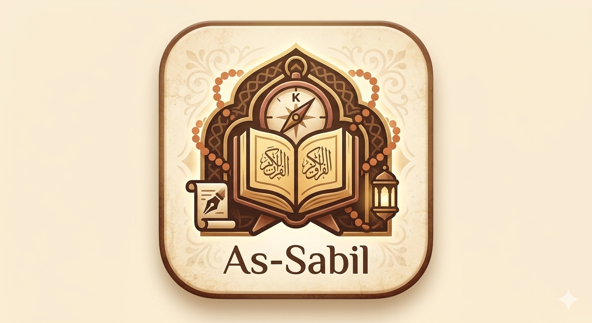
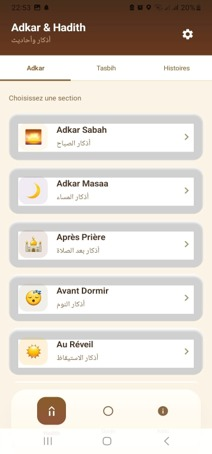
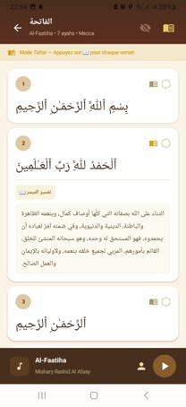
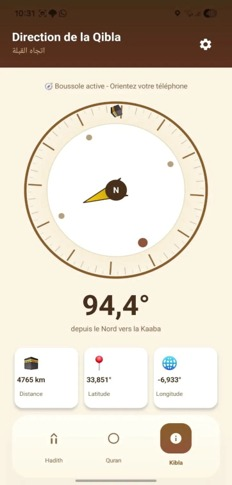
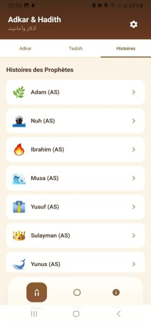
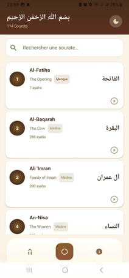

# Assabil Showcase

**Une application islamique moderne, complète et élégante conçue pour accompagner le musulman au quotidien.**

---

## 📖 Présentation du projet

**Assabil** est une application Android native développée en **Kotlin** et **Jetpack Compose**. Elle vise à offrir une expérience utilisateur premium, fluide et complète pour la pratique quotidienne de l'Islam, regroupant le Saint Coran (texte et audio), les Adkars, les Hadiths, la direction de la Qibla, ainsi que des outils de suivi et de personnalisation.

**Le but de ce dépôt est de présenter l'architecture, le design et les défis techniques d'Assabil sans exposer le code source propriétaire.**

### Problématique résolue
Les utilisateurs musulmans ont souvent besoin de télécharger plusieurs applications distinctes (une pour le Coran, une pour la Qibla, une pour les Adkars). Assabil résout ce problème en centralisant toutes ces fonctionnalités dans une interface unique, sans publicité intrusive, avec une expérience hors-ligne robuste.

### Utilisateurs cibles
- Les musulmans pratiquants souhaitant un outil de poche tout-en-un.
- Les personnes apprenant la religion et nécessitant des traductions (Français, Anglais) et translittérations.
- Les utilisateurs soucieux du respect de leur vie privée et cherchant une application performante.

---

## ✨ Fonctionnalités Principales

- **📖 Le Saint Coran** : Lecture fluide, traductions (français/anglais), recherche, gestion des favoris et suivi de la progression.
- **🎧 Audio** : Écoute des sourates en arrière-plan via un `Foreground Service`.
- **🕋 Qibla** : Boussole précise intégrée utilisant les capteurs de l'appareil.
- **📿 Adkars & Tasbih** : Invocations quotidiennes, compteur de Tasbih et favoris.
- **📜 Hadiths** : Les 40 Hadiths de Nawawi, Hadith du jour.
- **🌙 Mode Sombre & Personnalisation** : Interface adaptative Material 3 et respectueuse des paramètres système.

*Voir les [Fonctionnalités détaillées](docs/FEATURES.md)*

---

## 📸 Aperçus

| Accueil | Le Coran | Direction de la Qibla |
| :---: | :---: | :---: |
|  |  |  |

| Prières | Paramètres |
| :---: | :---: |
|  |  |

---

## 🏗 Architecture & Technologies

L'application suit les recommandations de Google avec une architecture **Clean Architecture** orientée **MVVM** (Model-View-ViewModel).

### 🛠 Stack Technique
- **Langage** : Kotlin
- **UI** : Jetpack Compose, Material Design 3
- **Injection de dépendances** : Hilt / Dagger
- **Base de données** : Room (SQLite)
- **Réseau** : Retrofit2, OkHttp3
- **Asynchronisme** : Coroutines, Flow
- **Travaux en arrière-plan** : WorkManager, Foreground Services
- **Navigation** : Jetpack Navigation Compose

### 📂 Documents techniques

Pour explorer en profondeur la conception technique de l'application, consultez la documentation détaillée :

* 🏛 [**Architecture**](docs/ARCHITECTURE.md) : Détails sur le MVVM, les couches et le Repository Pattern.
* 📊 [**Diagrammes Mermaid**](docs/DIAGRAMS.md) : Vues UML de l'architecture, des flux et de la navigation.
* 🧩 [**Stack Technique**](docs/TECH_STACK.md) : Justification des choix technologiques.
* 🚀 [**Workflow Utilisateur**](docs/WORKFLOW.md) : Parcours de l'utilisateur de A à Z.
* 🎨 [**UI / UX**](docs/UI_UX.md) : Philosophie de conception, accessibilité et design system.
* 🔒 [**Sécurité**](docs/SECURITY.md) : Bonnes pratiques et sécurisation des données.
* ⚡ [**Performances**](docs/PERFORMANCE.md) : Optimisation mémoire, cache et fluidité.
* 💡 [**Défis & Apprentissages**](docs/LESSONS_LEARNED.md) : Problèmes rencontrés et solutions techniques.

---

## 🚀 Améliorations futures
- Intégration des horaires de prières (Adhan) via géolocalisation.
- Support du mode paysage étendu pour tablettes.
- Extension du catalogue de Hadiths.
- Personnalisation de la voix du récitateur (Qari).

---

## 📬 Contact & Liens

Ce projet démontre une forte compétence en développement Android moderne (Compose, Hilt, Room, Coroutines).

Pour toute opportunité professionnelle ou question technique, n'hésitez pas à me contacter :

* 📧 Consultez le [Contact](docs/CONTACT.md)
* 💼 GitHub : [Jihane-ELAYOUCHI1](https://github.com/Jihane-ELAYOUCHI1)

---
*Ce dépôt est une vitrine générée. Le code source d'Assabil est privé.*
