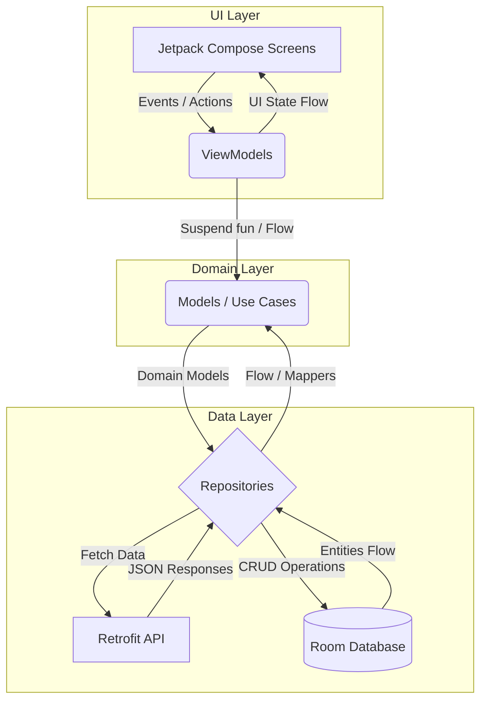
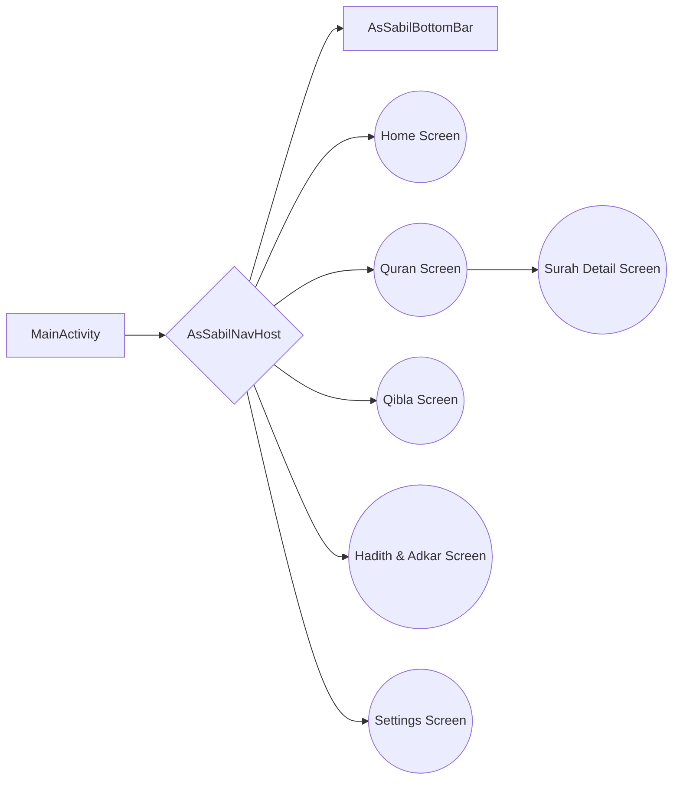
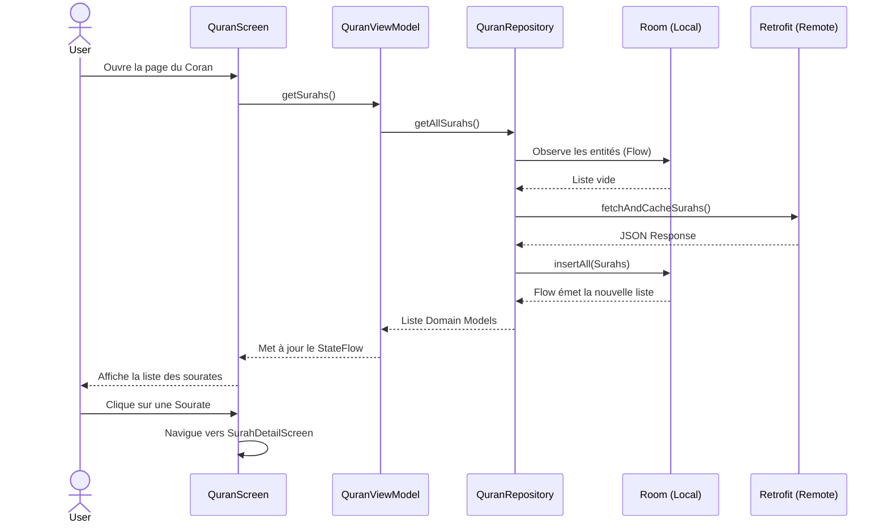
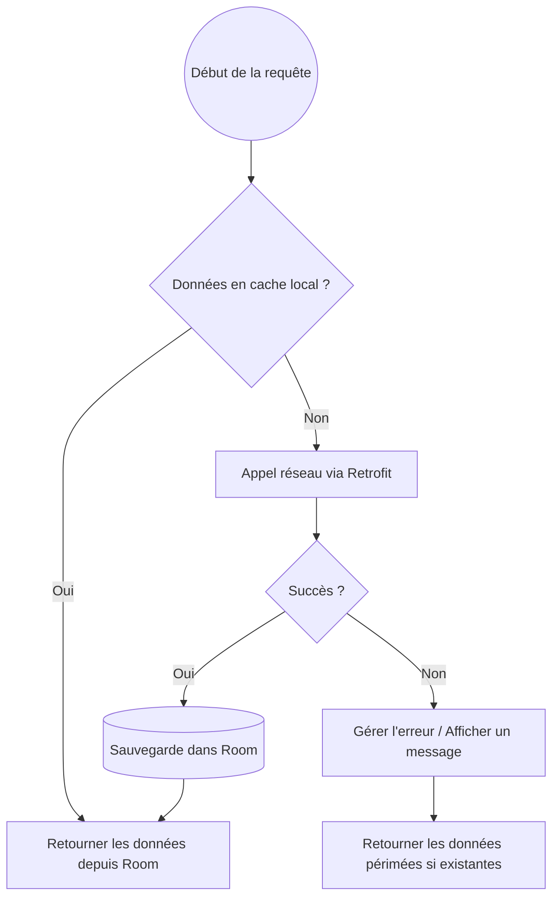
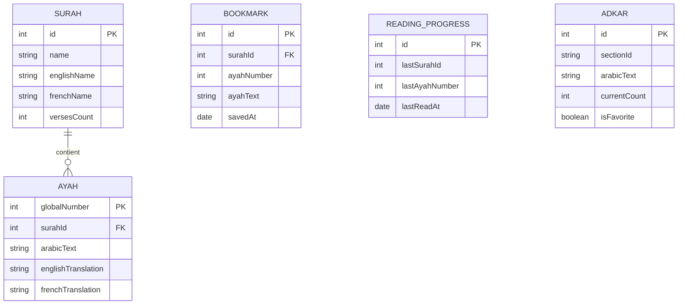

# Diagrammes

Les diagrammes ci-dessous illustrent la conception de l'application Assabil à différents niveaux d'abstraction.

---

## 1. Architecture Globale (Clean Architecture & MVVM)

---

## 2. Navigation (Jetpack Navigation Compose)

---

## 3. Flux Utilisateur : Lecture du Coran

---

## 4. Flux API et Gestion du Cache hors-ligne

---

## 5. Base de données (UML Simplifié)

